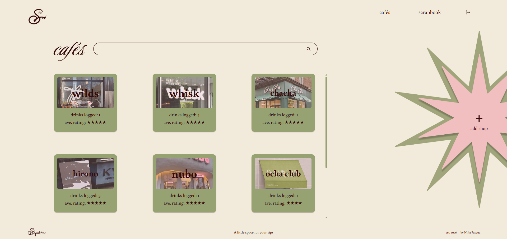

# Sipori

> **Replace this whole file.** It is a worked example of the README your project
> will be graded from, not a file to leave as it is. Start with
> [START-HERE.md](START-HERE.md).

Sipori is a personal log for discovering, rating, and keeping track of matcha and hojicha drinks.

**Live site:** https://yourusername.github.io/your-repo-name/
**API:** https://your-api.onrender.com/healthz
**Demo video:** (link)

> **Owner login is required.** Configure your single account with `npm run auth:setup`
> in `server`. See [Owner login](docs/owner-login.md) for setup and deployment.

## What it does

- Keep a personal log of cafés and the matcha or hojicha drinks tried at each one
- Record drink details including type, price, rating, reorder choice, notes and date
- Browse cafés and see the number of drinks logged and their average rating
- Search for cafés and filter drinks by matcha or hojicha
- Look back on past drinks through a monthly scrapbook

## Built with

React and Vite on the front end, Express and PostgreSQL on the back end. The
client is on GitHub Pages, the API on (host), the database on (host).

## Running it yourself

Sipori requires the real Express API and PostgreSQL. The previous browser-only
mock mode is disabled, even if `VITE_USE_MOCK_API` is still present in an old file.

1. Copy `server/.env.example` to `server/.env` and configure `DATABASE_URL`.
2. In `server`, run `npm install`, `npm run auth:setup`, then `npm run db:schema`.
3. Start the API with `npm run dev`.
4. In `client`, run `npm install`, copy `.env.example` to `.env` if needed,
   and run `npm run dev`.
5. Open the frontend and log in with your chosen credentials.

The API refuses to start without owner credentials. Read
[Owner login](docs/owner-login.md) for cookie settings and deployment requirements.

## Environment variables

None of these are committed. `.env.example` in each folder lists them with
placeholder values.

| Name | Where | What it is |
| --- | --- | --- |
| `DATABASE_URL` | server | PostgreSQL connection string. Contains a password |
| `CORS_ORIGINS` | server | comma-separated origins allowed to call the API |
| `NODE_ENV` | server | `production` on your host |
| `PORT` | server | **set by the host**, do not set it yourself |
| `OWNER_USERNAME` | server | single owner username |
| `OWNER_PASSWORD_HASH` | server | salted hash generated by `npm run auth:setup` |
| `AUTH_CROSS_SITE` | server | `true` only for cross-site HTTPS deployments |
| `VITE_API_BASE_URL` | client, at build time | your API's public URL, no trailing slash |

Every `VITE_` value is compiled into the built JavaScript and is **public**.
Never put a key, a password or a connection string in one.

## Deploying

**Client, to GitHub Pages.** Already wired up in
`.github/workflows/deploy-pages.yml`. Two one-time steps:

1. **Settings > Pages > Build and deployment > Source: GitHub Actions.** Without
   this the workflow goes green and publishes nothing.
2. Set `VITE_API_BASE_URL` under **Settings > Secrets and variables > Actions >
   Variables** to your configured API, then re-run the workflow. Follow the
   cross-site cookie instructions in [Owner login](docs/owner-login.md).

The repository must be **public** for Pages to serve it on a free account.

**API and database.** Not automated here, because most hosts deploy straight from
your repository with no workflow at all. Point your host at the `server/` folder,
set the environment variables in its dashboard, and run `server/db/schema.sql`
once against the hosted database.

## Project structure

    client/          React front end, built by Vite
      src/api/       authenticated HTTP API (legacy mock files are unused)
      src/components/
    server/          Express API
      db/            pool, schema.sql, seed.sql, and a runner for them
    compose.yml      only if you self-host
    docs/            your planning documents and weekly reports

## Architecture

Three or four sentences, or a small diagram. Which piece talks to which, and
where each one is hosted.

## What I would do next

Three honest bullets. This paragraph is worth more than it looks.

## Author

Your name, and a link. Course and section.

## AI use

If you used AI while building this, say so here. Honest disclosure is the
standard in this course and increasingly outside it, and reporting heavy use
accurately costs you nothing.

This section is the last 10 points of the finals badge, and it wants three
things:

- the badge above, or one you like better
- a line naming which assistant you used and how much of the work it touched
- a link to [AI-USAGE.md](AI-USAGE.md), where the full account lives

Keep the detail in `AI-USAGE.md` rather than here. This section is the summary a
visitor reads; that file is the record the badge is graded from.

## Licence

MIT, see [LICENSE](LICENSE). Put your own name in it.

### Cafe creation

The Add Shop modal collects cafe details and requires the first drink before saving.
The authenticated API uses
`POST /api/cafes` with `{ cafe, drink }` and a database transaction.
Before using this with an existing PostgreSQL database, run `npm run db:schema`
from `server` to add cafe image storage and allow drinks to remain unrated.
Images are optional; ratings are not collected by this form.
