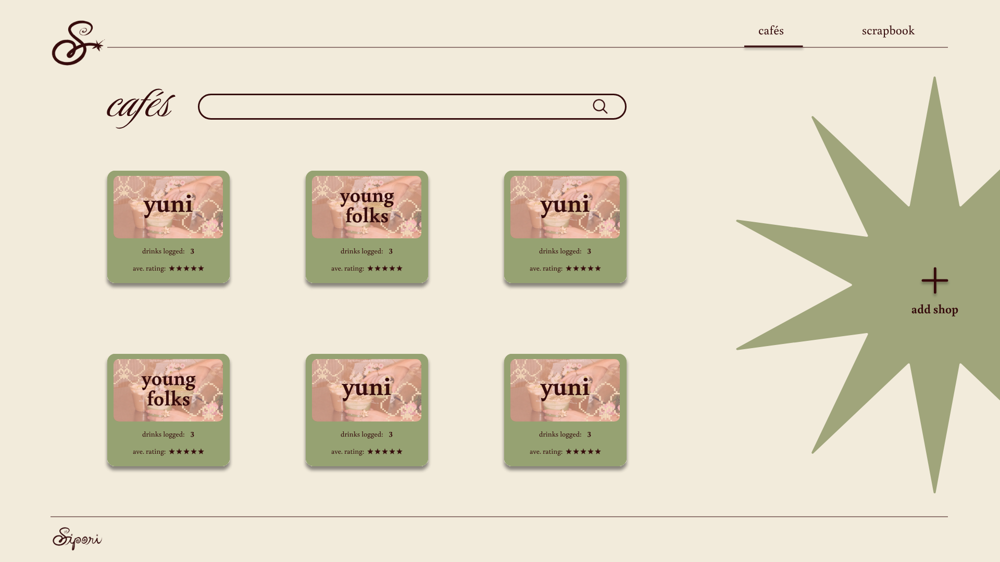
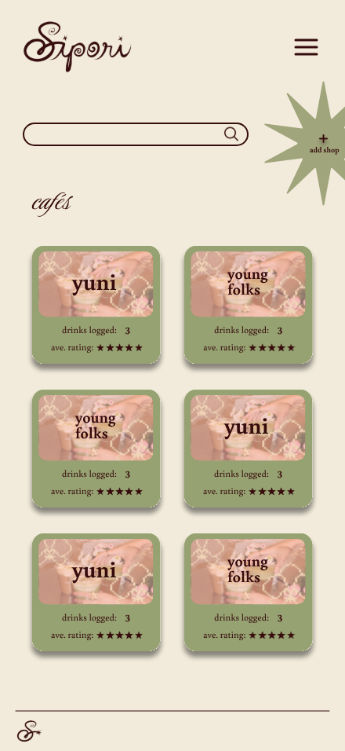
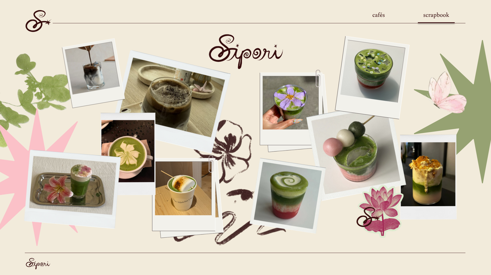
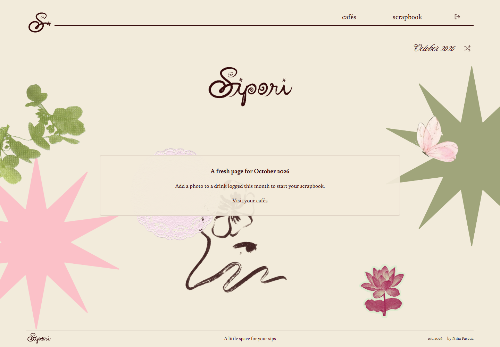

# Mockup

**My visual submission.** I used my existing high-fidelity Sipori designs. The exported images are stored in `docs/assets/mockup/`. The high-fidelity SVG exports were rendered to PNG at their original sizes: 1920 × 1080 for desktop and 440 × 956 for phone. The table below links all sixteen supplied high-fidelity frames, including interaction variants.

**High-fidelity exports.** These show my cream, dark brown, green, and pink palette, serif/script typography, illustrated star controls, cafe/drink content, and photo collage. Blank fields in the add forms represent an unfilled form, not placeholder page content.

| Screen or interaction | Desktop export | Phone export |
| --- | --- | --- |
| Cafes overview | [View](assets/mockup/desktop-cafes.png) | [View](assets/mockup/phone-cafes.png) |
| Cafes overview — add-shop hover variant | [View](assets/mockup/desktop-cafes-hover.png) | [View](assets/mockup/phone-cafes-hover.png) |
| Add cafe form | [View](assets/mockup/desktop-add-cafe.png) | [View](assets/mockup/phone-add-cafe.png) |
| Add first drink after creating a cafe | [View](assets/mockup/desktop-first-drink.png) | [View](assets/mockup/phone-first-drink.png) |
| Cafe page and drink cards | [View](assets/mockup/desktop-cafe-page.png) | [View](assets/mockup/phone-cafe-page.png) |
| Cafe page — add-drink hover variant | [View](assets/mockup/desktop-cafe-page-hover.png) | [View](assets/mockup/phone-cafe-page-hover.png) |
| Add drink to an existing cafe | [View](assets/mockup/desktop-add-drink.png) | [View](assets/mockup/phone-add-drink.png) |
| Scrapbook | [View](assets/mockup/desktop-scrapbook.png) | [View](assets/mockup/phone-scrapbook.png) |

| Additional screen/state | Image |
| --- | --- |
| Owner login | [View](assets/mockup/implemented-login-desktop.png) |
| Drink details with edit/delete actions | [View](assets/mockup/implemented-details-desktop.png) |
| Edit drink with recorded values and rating input | [View](assets/mockup/implemented-edit-desktop.png) |
| Delete confirmation | [View](assets/mockup/implemented-delete-desktop.png) |
| Empty current-month scrapbook | [View](assets/mockup/implemented-empty-desktop.png) |

## Honest note

The original add-drink mockups do not include a rating input, but the implemented form adds an optional 1–5 star rating. Owner login, separate drink details, editing, and delete confirmation were also added after these original designs; the supplemental screenshots show those additions. I preserved the visual direction while adjusting layout and interactions for the functioning app, so the final interface is not an exact copy of every frame.

The supplied frames cover the core planned journal screens. Registration and separate user journals remain future plans, not missing screens from these original mockups. The source designs use illustrative cafe/drink photographs; all of which are sourced from pinterest.

